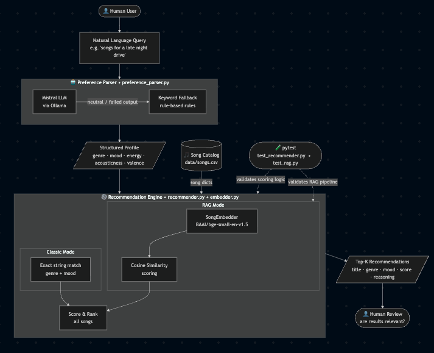

# 🎵 Musiholical 🎵

## Project Summary

The original goal of this music recommender system is to rank songs inputted to the system by several attributes of a song (e.g. genre, mood, energy level, etc.), and produce a list of recommended songs based on the rank.

Musiholical, the renewed version of the original system, provides smoother user experience in using the system to rank from the existing songs. It does so by following these steps:

1. Retrieve user input query
2. Send the query as a request to the LLM to convert it to estimated profiles
3. Convert existing songs and user profile into text descriptions
4. Embed these text descriptions so that songs that are semantically similar to the user profile get to ranked higher.
5. Present the user with two kinds of outputs:

   a. Classical outputs, which are the top recommending songs that are ranked with exact genre and mood match.

   b. RAG outputs, which are the top recommending songs hat are ranked based on semantic genre and mood similarity.

---

## Architecture Overview


The basic steps of how the system work is provided above, in Project Summary. In addition, any failed responses returned by the LLM will be replaced with fallback rules on matching keywords.

---

## Getting Started

### Setup

1. Create a virtual environment (optional but recommended):

   ```bash
   python -m venv .venv
   source .venv/bin/activate      # Mac or Linux
   .venv\Scripts\activate         # Windows

   ```

2. Install dependencies

```bash
pip install -r requirements.txt
```

### Query with LLM

This project uses Ollama, a free LLM model (Mistral to be exact), to process the natural language queries into music preferences. Note that due to the limitation of the used LLM model, the reasoning on why the model makes its suggestion on recommending songs can be incomplete.

1. Make sure that you have Ollama installed. Check out this website for installation: https://ollama.com/download.

1. Start Ollama with:

```
ollama serve
```

You should see "Listening on 127.0.0.1:11434".

2. Download the Mistral model (for first-time use only; make sure that you have at least 5 GB free RAM for the LLM to work properly):

```
ollama pull mistral
```

3. Run the program with demo:

```
python3 demo_natural_language.py
```

4. Run the program with own query:

```
python3 -m src.main
```

### Running Tests

Run the starter tests with:

```
python3 -m pytest tests/test_preference_parser.py -v
python3 -m pytest tests/test_rag.py -v
python3 -m pytest tests/test_recommender.py -v
```

## Experiments You Tried

### _1. Query: Cyber._

Describe the music you want: Cyber

Parsing your preference with Ollama...

Extracted preference:
Query: 'Cyber'
Reasoning: "Cyber" interpreted as intense electronic — high-energy, electronic, melancholic tone.
Profile: {'genre': 'electronic', 'mood': 'intense', 'energy': 1.0, 'acousticness': 0.0, 'valence': 0.0}

User profile: {'genre': 'electronic', 'mood': 'intense', 'energy': 1.0, 'acousticness': 0.0, 'valence': 0.0}

### - Classical mode:

#1 Storm Runner by Voltline
Genre: rock | Mood: intense
Score: 0.70
Why: - Mood matches your favorite 'intense' (+0.35) - Genre 'rock' does not match your favorite 'electronic' (+0.00) - Energy 0.91 vs your target 1.00 (+0.18) - Valence 0.48 vs your target 0.00 (+0.05) - Tempo 152 BPM vs preferred 200 BPM (+0.06) - Acousticness 0.10 vs your target 0.00 (+0.05) - Danceability 0.66 vs preferred 1.00 (+0.01)

#2 Gym Hero by Max Pulse
Genre: pop | Mood: intense
Score: 0.67
Why: - Mood matches your favorite 'intense' (+0.35) - Genre 'pop' does not match your favorite 'electronic' (+0.00) - Energy 0.93 vs your target 1.00 (+0.19) - Valence 0.77 vs your target 0.00 (+0.02) - Tempo 132 BPM vs preferred 200 BPM (+0.05) - Acousticness 0.05 vs your target 0.00 (+0.05) - Danceability 0.88 vs preferred 1.00 (+0.02)

#3 Fracture Point by Iron Veil
Genre: metal | Mood: angry
Score: 0.40
Why: - Mood 'angry' does not match your favorite 'intense' (+0.00) - Genre 'metal' does not match your favorite 'electronic' (+0.00) - Energy 0.98 vs your target 1.00 (+0.20) - Valence 0.22 vs your target 0.00 (+0.08) - Tempo 168 BPM vs preferred 200 BPM (+0.06) - Acousticness 0.04 vs your target 0.00 (+0.05) - Danceability 0.52 vs preferred 1.00 (+0.01)

### - RAG mode:

#1 Fracture Point by Iron Veil
Genre: metal | Mood: angry
Score: 0.88
Why: - Semantic similarity (mood + genre) 0.88 (+0.48) - Energy 0.98 vs your target 1.00 (+0.20) - Valence 0.22 vs your target 0.00 (+0.08) - Tempo 168 BPM vs preferred 200 BPM (+0.06) - Acousticness 0.04 vs your target 0.00 (+0.05) - Danceability 0.52 vs preferred 1.00 (+0.01)

#2 Storm Runner by Voltline
Genre: rock | Mood: intense
Score: 0.84
Why: - Semantic similarity (mood + genre) 0.89 (+0.49) - Energy 0.91 vs your target 1.00 (+0.18) - Valence 0.48 vs your target 0.00 (+0.05) - Tempo 152 BPM vs preferred 200 BPM (+0.06) - Acousticness 0.10 vs your target 0.00 (+0.05) - Danceability 0.66 vs preferred 1.00 (+0.01)

#3 Neon Ascent by Pulse Grid
Genre: edm | Mood: euphoric
Score: 0.82
Why: - Semantic similarity (mood + genre) 0.90 (+0.49) - Energy 0.96 vs your target 1.00 (+0.19) - Valence 0.88 vs your target 0.00 (+0.01) - Tempo 140 BPM vs preferred 200 BPM (+0.05) - Acousticness 0.02 vs your target 0.00 (+0.05) - Danceability 0.95 vs preferred 1.00 (+0.02)

### _2. Query: I want some lovely vide songs._

Describe the music you want: I want some lovely vide songs.

Parsing your preference with Ollama...

Extracted preference:
Query: 'I want some lovely vide songs.'
Reasoning: "I want some lovely vide songs." interpreted as happy pop — mid-energy, electronic, upbeat tone.
Profile: {'genre': 'pop', 'mood': 'happy', 'energy': 0.6, 'acousticness': 0.2, 'valence': 0.9}

User profile: {'genre': 'pop', 'mood': 'happy', 'energy': 0.6, 'acousticness': 0.2, 'valence': 0.9}

### - Classical mode:

#1 Sunrise City by Neon Echo
Genre: pop | Mood: happy
Score: 0.94
Why: - Mood matches your favorite 'happy' (+0.35) - Genre matches your favorite 'pop' (+0.20) - Energy 0.82 vs your target 0.60 (+0.16) - Valence 0.84 vs your target 0.90 (+0.09) - Tempo 118 BPM vs preferred 136 BPM (+0.07) - Acousticness 0.18 vs your target 0.20 (+0.05) - Danceability 0.79 vs preferred 0.60 (+0.02)

#2 Rooftop Lights by Indigo Parade
Genre: indie pop | Mood: happy
Score: 0.74
Why: - Mood matches your favorite 'happy' (+0.35) - Genre 'indie pop' does not match your favorite 'pop' (+0.00) - Energy 0.76 vs your target 0.60 (+0.17) - Valence 0.81 vs your target 0.90 (+0.09) - Tempo 124 BPM vs preferred 136 BPM (+0.07) - Acousticness 0.35 vs your target 0.20 (+0.04) - Danceability 0.82 vs preferred 0.60 (+0.02)

#3 Gym Hero by Max Pulse
Genre: pop | Mood: intense
Score: 0.56
Why: - Mood 'intense' does not match your favorite 'happy' (+0.00) - Genre matches your favorite 'pop' (+0.20) - Energy 0.93 vs your target 0.60 (+0.13) - Valence 0.77 vs your target 0.90 (+0.09) - Tempo 132 BPM vs preferred 136 BPM (+0.08) - Acousticness 0.05 vs your target 0.20 (+0.04) - Danceability 0.88 vs preferred 0.60 (+0.01)

### - RAG mode:

#1 Rooftop Lights by Indigo Parade
Genre: indie pop | Mood: happy
Score: 0.89
Why: - Semantic similarity (mood + genre) 0.91 (+0.50) - Energy 0.76 vs your target 0.60 (+0.17) - Valence 0.81 vs your target 0.90 (+0.09) - Tempo 124 BPM vs preferred 136 BPM (+0.07) - Acousticness 0.35 vs your target 0.20 (+0.04) - Danceability 0.82 vs preferred 0.60 (+0.02)

#2 Sunrise City by Neon Echo
Genre: pop | Mood: happy
Score: 0.89
Why: - Semantic similarity (mood + genre) 0.91 (+0.50) - Energy 0.82 vs your target 0.60 (+0.16) - Valence 0.84 vs your target 0.90 (+0.09) - Tempo 118 BPM vs preferred 136 BPM (+0.07) - Acousticness 0.18 vs your target 0.20 (+0.05) - Danceability 0.79 vs preferred 0.60 (+0.02)

#3 Velvet Hours by Simone Reyes
Genre: r&b | Mood: romantic
Score: 0.87
Why: - Semantic similarity (mood + genre) 0.86 (+0.47) - Energy 0.61 vs your target 0.60 (+0.20) - Valence 0.75 vs your target 0.90 (+0.09) - Tempo 86 BPM vs preferred 136 BPM (+0.06) - Acousticness 0.31 vs your target 0.20 (+0.04) - Danceability 0.77 vs preferred 0.60 (+0.02)

---

## Limitations and Risks

Why you built it this way, and what trade-offs you made.

The backbone of the system is built with Ollama Mistral, for which the LLM can accurately convert user queries into respective user profile, which will then be used for embedding. The system was originally designed with Ollama Tinyllama for its light-weight requirement on free RAM of the device. However, as the development went on, we found that Tinyllama could not accurately capture the user queries, which rendered the working process of the system infeasible. After switching to Mistral, although the RAM requirement went up from around 1 GB to 5 GB, the results show that it is worth trading free RAM with performance.

---

## Testing Summary

### test_rag.py:

_TestSongEmbedder_ — Unit tests for the embedder itself
_TestRAGIntegration_ — Integration tests against the real dataset
_TestBackwardCompatibility_ — Regression tests for classic mode

All written tests work as expected.

### test_recommender.py:

Test functions around the Recommender class in classic mode.

All written tests work as expected.

### test_preference_parser.py:

Test whether the LLM responses are on point, and whether the responses can be correctly parsed by the program.

62 out of 62 tests passed successfully.

## Reflection and Ethics

I learned that we can embed existing songs and user profile to produce a similarity matching such that when inputted with future user profile, it would return the songs that are most semantically close to the profile. I also learned that in order to refine the accuracy of the system, one need to have a huge database consisting with songs and their corresponding metrics (e.g. genre, mood, energy, etc.)

AI isn't just about what works -- it's about what's responsible. Include a short reflection answering the following questions:

There is a bias in the model. If the song catalog used for the calculation is imbalanced (i.e. the catalog contains more songs for a specific metric), then the user who has a minor/niche preference might receive poor recommendations due to the underrepresentation of their preferred songs in the catalog.

The model can be misused when instead of song catalog and user profile, it was given things that are harmful, but it will rank these things correctly. For future improvement I think it is necessary to have the prompt mentioning that if the input given to the LLM contains harmful data, then LLM should respond nothing or useless responses instead.

I was surprised that the LLM as well as the embedding system utilized by the model work very well to complement each other. For the most of the time, the conversion of user query to user profile by LLM is on point.

The utilization of AI tools helped me break down some potential biases existed in the system. I needed to double-check the response provided by these tools when I noticed that the formatting (e.g. the return type of a function) from the response is different from the parameters required by other functions, for which this could cause the system to function incorrectly.

---

## Loom Demo Video Link

https://www.loom.com/share/43582168db764522b7f499a2d08fb5c7
