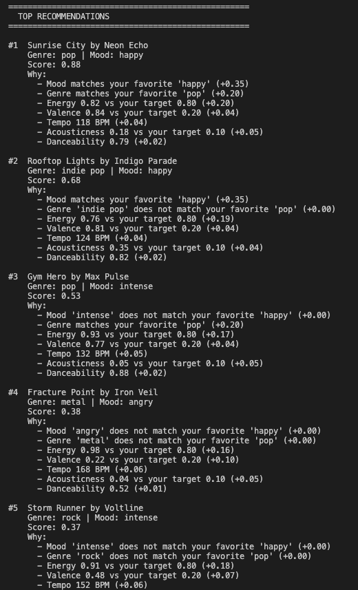

# 🎵 Music Recommender Simulation

## Project Summary

In this project you will build and explain a small music recommender system.

Your goal is to:

- Represent songs and a user "taste profile" as data
- Design a scoring rule that turns that data into recommendations
- Evaluate what your system gets right and wrong
- Reflect on how this mirrors real world AI recommenders

Replace this paragraph with your own summary of what your version does.

---

## How The System Works

From my understanding, the real-world recommendation system resolves around a large amount of user data (user preferences to songs/videos based on their attributes, such as mood, genre, energy, etc). The system then constructs a value matrix that uses these user data, which can then be utilized to compare the overlapping between the preference of a target user to preferences of all other users (or, only select a range of more relevant users to provide better accuracy).

The design of this music recommendation system follows the same track, that it evaluates the music preferences of users to filter and finally recommend the most relevant songs to the target user. The system will take some most valuable features of a song, such as mood, genre, and energy combined with acousticness (ordered from the most important one to the least), to provide a relevance score for each available song, as well as constructing a list of songs that the target user will most likely be interested in based on their relevance scores.

The `Song` used in this system will contain basic information such as the unique id, title, artist, as well as the metrics that would be used to calculate the recommendation score for the song, such as genre, mood, energy, valence, and more.

The `UserProfile` of the system will store information including but not limited to a user's favorite genre, the most suitable mood, the amount of energy the user might have while using the system, and the likeness towards acoustical music.

Note that it should be acknowledged beforehand that the system contains several biases. For example, songs with higher values in tempo and danceability might be prioritized since the `UserProfile` of the system does not depend on the user's preference on these values, meaning that the higher values of these metrics, the higher score the song will be given when calculating their recommendation scores. Furthermore, if the song catalog used for the calculation is imbalanced (i.e. the catalog contains more songs for a specific metric), then the user who has a minor/niche preference might receive poor recommendations due to the underrepresentation of their preferred songs in the catalog.

### Sample Output Generated by the System:

<a href="sample_output.png" target="_blank"></a>.

---

## Getting Started

### Setup

1. Create a virtual environment (optional but recommended):

   ```bash
   python -m venv .venv
   source .venv/bin/activate      # Mac or Linux
   .venv\Scripts\activate         # Windows

   ```

2. Install dependencies

```bash
pip install -r requirements.txt
```

3. Run the app:

```bash
python -m src.main
```

### Running Tests

Run the starter tests with:

```bash
pytest
```

You can add more tests in `tests/test_recommender.py`.

---

## Experiments You Tried

Use this section to document the experiments you ran. For example:

- What happened when you changed the weight on genre from 2.0 to 0.5
- What happened when you added tempo or valence to the score
- How did your system behave for different types of users

---

## Limitations and Risks

Summarize some limitations of your recommender.

Examples:

- It only works on a tiny catalog
- It does not understand lyrics or language
- It might over favor one genre or mood

You will go deeper on this in your model card.

---

## Reflection

Read and complete `model_card.md`:

[**Model Card**](model_card.md)

Write 1 to 2 paragraphs here about what you learned:

- about how recommenders turn data into predictions
- about where bias or unfairness could show up in systems like this

---

## 7. `model_card_template.md`

Combines reflection and model card framing from the Module 3 guidance. :contentReference[oaicite:2]{index=2}

```markdown
# 🎧 Model Card - Music Recommender Simulation

## 1. Model Name

Give your recommender a name, for example:

> VibeFinder 1.0

---

## 2. Intended Use

- What is this system trying to do
- Who is it for

Example:

> This model suggests 3 to 5 songs from a small catalog based on a user's preferred genre, mood, and energy level. It is for classroom exploration only, not for real users.

---

## 3. How It Works (Short Explanation)

Describe your scoring logic in plain language.

- What features of each song does it consider
- What information about the user does it use
- How does it turn those into a number

Try to avoid code in this section, treat it like an explanation to a non programmer.

---

## 4. Data

Describe your dataset.

- How many songs are in `data/songs.csv`
- Did you add or remove any songs
- What kinds of genres or moods are represented
- Whose taste does this data mostly reflect

---

## 5. Strengths

Where does your recommender work well

You can think about:

- Situations where the top results "felt right"
- Particular user profiles it served well
- Simplicity or transparency benefits

---

## 6. Limitations and Bias

Where does your recommender struggle

Some prompts:

- Does it ignore some genres or moods
- Does it treat all users as if they have the same taste shape
- Is it biased toward high energy or one genre by default
- How could this be unfair if used in a real product

---

## 7. Evaluation

How did you check your system

Examples:

- You tried multiple user profiles and wrote down whether the results matched your expectations
- You compared your simulation to what a real app like Spotify or YouTube tends to recommend
- You wrote tests for your scoring logic

You do not need a numeric metric, but if you used one, explain what it measures.

---

## 8. Future Work

If you had more time, how would you improve this recommender

Examples:

- Add support for multiple users and "group vibe" recommendations
- Balance diversity of songs instead of always picking the closest match
- Use more features, like tempo ranges or lyric themes

---

## 9. Personal Reflection

A few sentences about what you learned:

- What surprised you about how your system behaved
- How did building this change how you think about real music recommenders
- Where do you think human judgment still matters, even if the model seems "smart"
```
