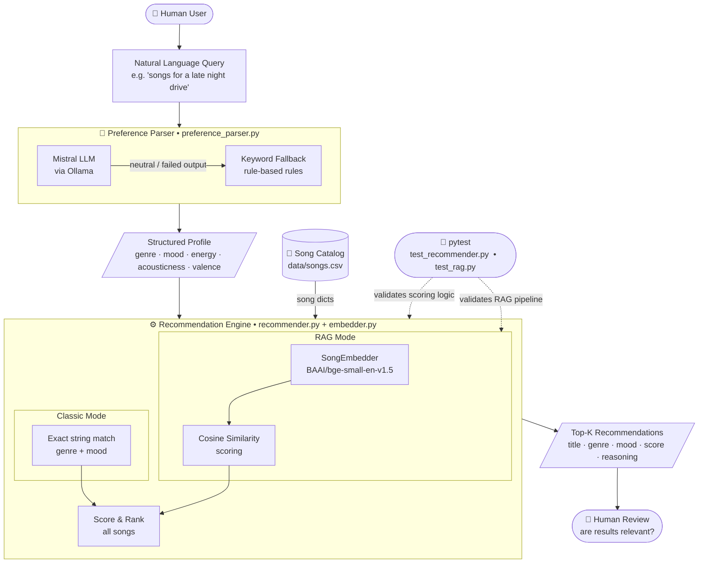

# System Diagram

```mermaid
flowchart TD
    User(["👤 Human User"])
    Query["Natural Language Query\ne.g. 'songs for a late night drive'"]

    subgraph Parser["🤖 Preference Parser  •  preference_parser.py"]
        LLM["Mistral LLM\nvia Ollama"]
        Fallback["Keyword Fallback\nrule-based rules"]
        LLM -- "neutral / failed output" --> Fallback
    end

    Profile[/"Structured Profile\ngenre · mood · energy · acousticness · valence"/]

    Catalog[("🎵 Song Catalog\ndata/songs.csv")]

    subgraph Engine["⚙️ Recommendation Engine  •  recommender.py + embedder.py"]
        subgraph Classic["Classic Mode"]
            ExactMatch["Exact string match\ngenre + mood"]
        end
        subgraph RAG["RAG Mode"]
            Embed["SongEmbedder\nBAAI/bge-small-en-v1.5"]
            Cosine["Cosine Similarity\nscoring"]
            Embed --> Cosine
        end
        Rank["Score & Rank\nall songs"]
        ExactMatch --> Rank
        Cosine --> Rank
    end

    Results[/"Top-K Recommendations\ntitle · genre · mood · score · reasoning"/]

    Review(["👤 Human Review\nare results relevant?"])

    Tests(["🧪 pytest\ntest_recommender.py  •  test_rag.py"])

    User --> Query
    Query --> Parser
    Parser --> Profile
    Profile --> Engine
    Catalog -->|"song dicts"| Engine
    Engine --> Results
    Results --> Review

    Tests -. "validates scoring logic" .-> Engine
    Tests -. "validates RAG pipeline" .-> RAG
```
